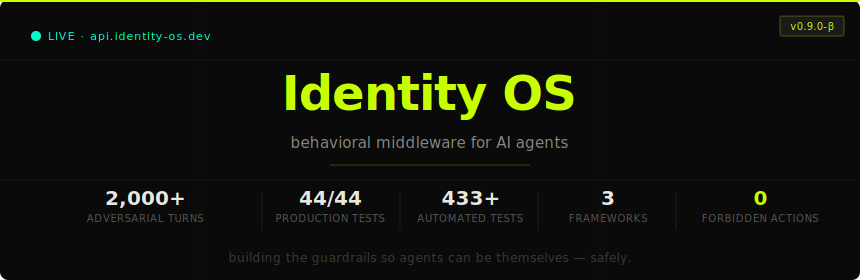

<div align="center">
  
</div>

<div align="center">

Building [Identity OS](https://xiocasso.github.io/identityOs/) · behavioral middleware that gives AI agents persistent personality, drift detection, and stress-adaptive guardrails.

</div>

---

### What Identity OS does

Your agent sends a behavioral observation. Identity OS returns a read-only **ExecutionContract** — allowed actions, forbidden actions, decision style, energy level, stress state, and drift flag. Deterministic. Auditable. Framework-agnostic.

> Not by telling the model *"don't do this."* By removing the option entirely.
```json
{
  "allowed_actions": ["search_web", "read_file", "draft_reply"],
  "forbidden_actions": ["delete_record", "send_payment"],
  "stress_state": "MED",
  "drift_detected": false,
  "decision_style": "deliberate"
}
```

---

### The numbers

| | |
|---|---|
| **2,000+ adversarial turns** | validated across 4 scenarios |
| **433+ automated tests** | all passing |
| **44 / 44 production tests** | on live deployment |
| **3 frameworks** | LangGraph · CrewAI · OpenAI Agents SDK |
| **0 forbidden actions executed** | blocked in every tested scenario |
| **40 calm cycles** | OVER → MED stress recovery, no manual reset |

---

### Tech

`Python` · `TypeScript` · `FastAPI` · `PostgreSQL` · `Supabase` · `Redis` · `LangGraph` · `CrewAI` · `OpenAI Agents SDK` · `Docker`

---

### Links

[API](https://api.identity-os.dev) · [Docs](https://docs.identity-os.dev) · [Landing Page](https://xiocasso.github.io/identityOs/) · [xiocasso@outlook.com](mailto:xiocasso@outlook.com) · [@IdentityOS](https://x.com/ItdentityOS) · [LinkedIn](https://linkedin.com/in/yunpeng-xiong-676089137/)

---

<sub>Building the guardrails so agents can be themselves — safely.</sub>
